# RT-Extension-BeautifyUI

Visual enhancements, UI polish, and dashboard widgets for Request Tracker 6.

A living extension — new features and improvements are added continuously
as the RT 6 environment evolves. Consider it a permanent work in progress.

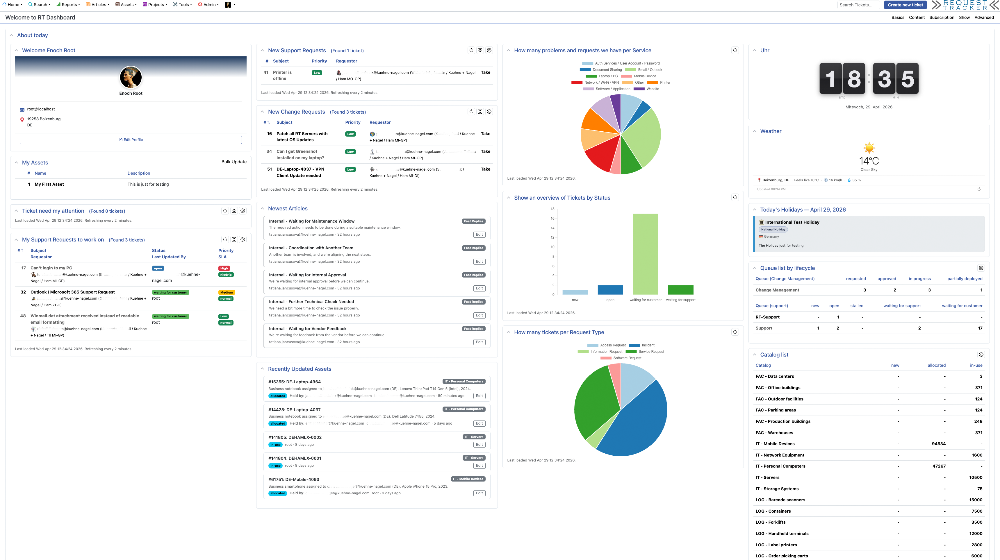

## Features

### Icons
- **Bootstrap Icons 1.11.3** loaded globally via CDN
- Section icons on ticket widget panels (Basics, People, Dates, Links,
  Attachments, Times, Reminders, Description, History, Custom Fields)
- Section icons on asset and article display widgets
- Coloured icons in the main navigation menu (Home, Search, Reports,
  Articles, Assets, Projects, Tools, Admin)

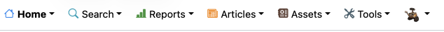


### Ticket List Enhancements (ColumnMap)
- **Owner** — red when unassigned (*Nobody*), green when assigned to self
- **Status** — shows a "New Reply" warning badge when the last update came
  from a requestor or CC and the current user has not yet seen it
- **Due / DueRelative** — coloured badge (green / yellow / red) based on
  time remaining
- **SLA** — coloured badge derived from the relative urgency of configured
  SLA levels
- **ExtendedStatus** — pending-approval or pending-ticket badge with link
- **Requestor / Cc / AdminCc** — avatar thumbnail next to each name

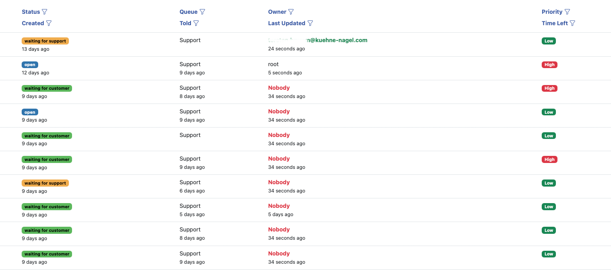

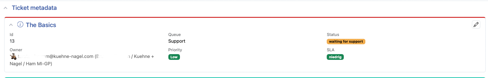

### Ticket Display Widgets
- **Due date** colour coded on the ticket widget (AfterDue callback)
- **SLA level** colour coded on the ticket widget (EndOfList callback)
- **LinkedArticles** — sidebar widget listing all articles linked to the
  current ticket; hidden when no articles are linked, auto-refreshes via
  HTMX when links change

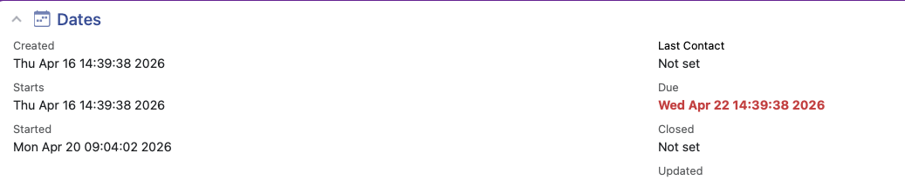

### General Styling
- Action-results banner (green left-border card after ticket update)
- Dependency-status banner (orange left-border alert)
- Priority badges (low / medium / high / on\_fire) in traffic-light colours
- Article card styling: hover accent border, 2-line summary clamp, empty
  state icon
- Pending-ticket badge

---

## Dashboard Widgets

All widgets are registered automatically — no manual `HomepageComponents`
configuration required. Each widget can be added to any RT dashboard via
**Dashboards → Edit → Add portlet**.

### ClockWidget

A flip-clock showing the current local time with animated digit panels and
a date line below. All styling is self-contained (no external files).

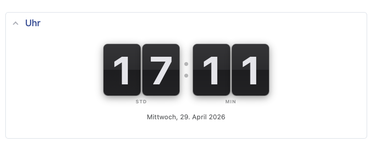

### WeatherWidget

Displays current weather conditions based on the logged-in user's **City**,
**Zip**, and **Country** profile fields.

- Weather data from [Open-Meteo](https://open-meteo.com/) (free, no API key,
  EU-hosted)
- Geocoding via [Nominatim / OpenStreetMap](https://nominatim.openstreetmap.org/)
- Shows temperature, feels-like, wind speed, humidity, condition icon
- 30-minute sessionStorage cache to avoid redundant API calls
- Adapts to RT light / dark / KN / Terminal themes
- 12 UI languages: de, en, es, fr, it, ja, nl, pl, pt\_BR, ru, sv, zh\_CN

**Requirements:** Each user must have City and/or Zip and Country filled in
their RT user profile. Browser must have outbound HTTPS access to
`api.open-meteo.com` and `nominatim.openstreetmap.org`.

**Configuration:**

```perl
Set(%WeatherWidgetOptions,
    TemperatureUnit => 'celsius',   # or 'fahrenheit'
);
```

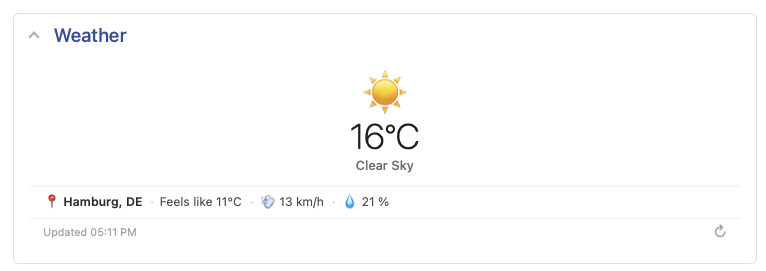

### ArticlesWidget

Shows the 5 newest knowledge-base articles across all enabled classes the
current user can see. Each card displays name, class badge, summary,
creator, age, and an Edit button for users with modify rights.

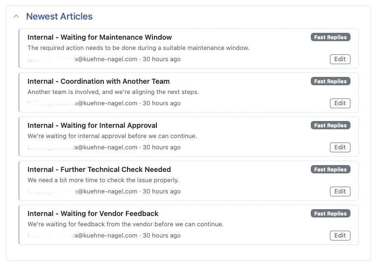

### Articles Page

The Articles index page (`/Articles/`) is replaced with a custom layout
providing statistics, quick search, class browsing, recently viewed, and
article creation — all as separate collapsible sidebar panels.

**Statistics** — total article count, number of classes, articles created
this month, and a top-contributors list.

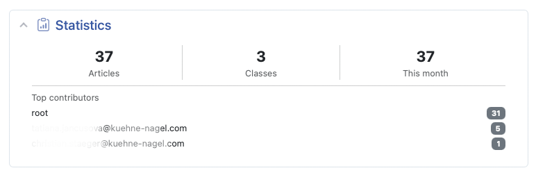

**Quick Search** — full-text search box with one-click class filter buttons.

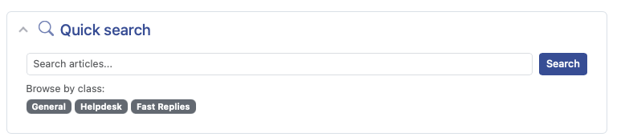

**Create an article** — shortcut links to create a new article in any class.

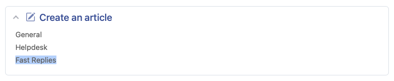

**Articles by class** — all articles grouped and browseable by class.

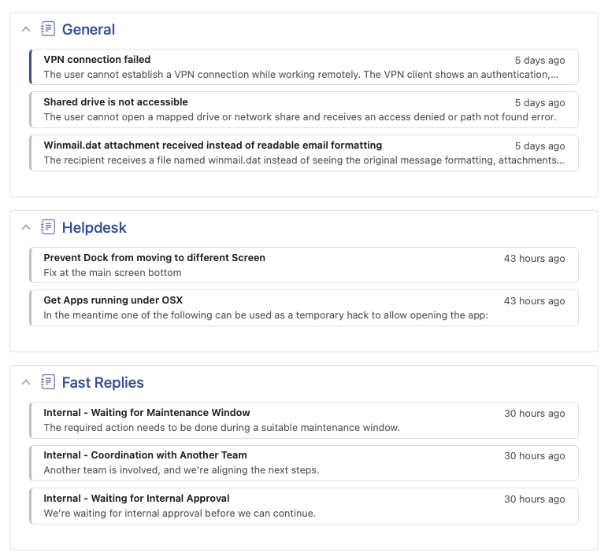

**Recently viewed** — the current user's last-seen articles with class badge.

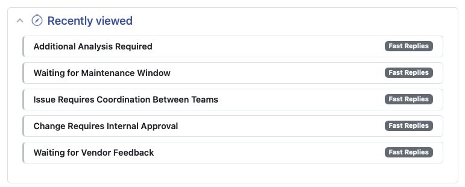

**Newest articles** — compact list of the 10 most recently created articles.


**Recently updated articles** — compact list of the 10 most recently changed articles.


### AssetsWidget

Shows the 5 most recently updated active assets. Each card displays asset
ID, name, catalog badge, description, status, Held By user(s), last updater,
and age. An Edit button appears for users with modify rights.


### UserProfileWidget

A profile card for the currently logged-in user, featuring:

- Gradient banner (dark → white, adapts to dark mode)
- Avatar photo from RT's user image helper
- Real name and organisation
- Email (with `mailto:` link)
- Work phone and mobile phone (with `tel:` links)
- Postal address
- Edit Profile button linking to Prefs

Widget title reads **Welcome [Full Name]** (or username if no real name set).

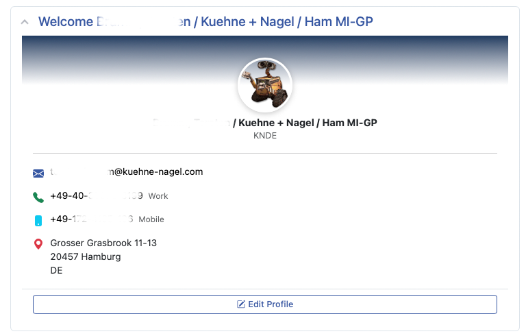

### LinkedArticles (Ticket Display Widget)

A sidebar widget on the ticket display page that lists all articles linked
to the current ticket. Unlike the dashboard widgets above, this widget appears
directly on the ticket page — no portlet configuration needed.

- Shows article name (linked), class badge, and summary
- Hidden automatically when the ticket has no linked articles
- Refreshes via HTMX when ticket links are added or removed
- Works with any link type (refers-to, depended-on-by, etc.)

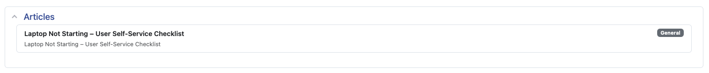

### TodaysHolidays

Shows today's worldwide public holidays on any dashboard. Also injects a
banner above the RT login form on days with matching holidays.

- Data from bundled `holidays-worldwide.csv` (~280 entries, 100+ countries)
- Entries for national, religious, cultural, international, and regional
  holidays
- Country flag emoji via ISO 3166-1 lookup
- Colour-coded by holiday type
- Multi-entry days show per-country sub-cards

---

## Requirements

- Request Tracker 6.0.2 or later
- Internet access for Bootstrap Icons CDN (or self-host and adjust the
  `@import` URL in `beautify-ui.css`)
- For WeatherWidget: browser outbound HTTPS to Open-Meteo and Nominatim

## Installation

```bash
perl Makefile.PL
make
sudo make install
```

### Deploy the holidays CSV

```bash
cp /opt/rt6/local/plugins/RT-Extension-BeautifyUI/etc/holidays-worldwide.csv \
   /opt/rt6/local/etc/holidays-worldwide.csv
```

### Register the plugin

Add to `/opt/rt6/etc/RT_SiteConfig.pm`:

```perl
Plugin('RT::Extension::BeautifyUI');
```

All dashboard widgets are registered automatically — no `HomepageComponents`
change needed.

### Optional configuration

See `etc/BeautifyUI_Config.pm.sample` for all options. The most common ones:

```perl
# WeatherWidget temperature unit (default: celsius)
Set(%WeatherWidgetOptions,
    TemperatureUnit => 'celsius',   # or 'fahrenheit'
);

# Custom path for the holidays CSV (default: $RT::LocalEtcPath/holidays-worldwide.csv)
Set($HolidaysCSVPath, '/opt/rt6/local/etc/holidays-worldwide.csv');
```

### Clear cache and restart

```bash
sudo systemctl stop apache2
sudo rm -rf /opt/rt6/var/mason_data/obj/*
sudo systemctl start apache2
```

---

## Updating the Holidays Data

Edit `etc/holidays-worldwide.csv` and redeploy to `$RT::LocalEtcPath`. No
restart required — the file is read on every page load.

The bundled update script can fetch fresh data:

```bash
/opt/rt6/local/plugins/RT-Extension-BeautifyUI/bin/rt-update-public-holidays \
    --csv /opt/rt6/local/etc/holidays-worldwide.csv
```

### CSV format

```
Date,Holiday,Countries,Type,Description
```

| Column | Format |
|---|---|
| Date | `MM-DD` (fixed) or `MM-DD/DD` (two-day range) |
| Holiday | Name; multiple same-date holidays joined with ` · ` |
| Countries | Country name(s) separated by ` · ` |
| Type | `National Holiday`, `Religious Holiday`, `Cultural Holiday`, etc. |
| Description | Free text; for consolidated entries also separated by ` · ` |

---

## Changelog

### 2.1.0

**Ticket Display Widget: LinkedArticles**

- Added `html/Ticket/Widgets/Display/LinkedArticles` — widget registration
  with a `PreCheck` method that hides the widget entirely when no articles
  are linked to the ticket
- Added `html/Ticket/Elements/ShowLinkedArticles` — renders each linked
  article as a Bootstrap card (name, class badge, summary); refreshes
  automatically via HTMX on `ticketLinksChanged`
- `BeautifyUI.pm`: added *Ticket Display Widgets* POD section
- `Makefile.PL`: minimum RT version raised from 5.0.0 to 6.0.2
- `README.md`: LinkedArticles documented throughout; requirements updated

### 2.0.0 — Mega-consolidation

Absorbs six formerly standalone extensions into a single plugin.

**Dashboard Widgets** (all registered in `HomepageComponents` automatically)

- **ClockWidget** — flip-clock with animated digit panels and date line;
  fully self-contained CSS
- **WeatherWidget** — live weather via Open-Meteo, geocoding via
  Nominatim / Open-Meteo geocoding API, 12 PO languages, supports RT
  light / dark / KN / Terminal themes, 30-minute sessionStorage cache
- **ArticlesWidget** — 5 newest knowledge-base articles across all classes
  the current user can see; name, class badge, summary, creator, age,
  Edit button
- **AssetsWidget** — 5 most recently updated active assets; ID, name,
  catalog badge, description, status, Held By, last updater, age,
  Edit button
- **UserProfileWidget** — profile card with gradient banner, avatar,
  real name, organisation, email, phone numbers, postal address,
  Edit Profile link; title reads "Welcome [Full Name]"
- **TodaysHolidays** — worldwide public holidays for today from the
  bundled `holidays-worldwide.csv` (~280 entries, 100+ countries);
  country flag emoji, colour-coded by type, per-country sub-cards;
  also injects a banner above the RT login form

**Articles page overrides** (`html/Articles/Elements/`)

- ArticlesByClass, CreateArticle, NewestArticles, QuickSearch,
  RecentlyViewed, Stats, UpdatedArticles, index.html

**Infrastructure**

- `etc/BeautifyUI_Config.pm.sample` — documents all configuration options
- `etc/holidays-worldwide.csv` — bundled holiday dataset
- `bin/rt-update-public-holidays` — script to refresh holiday data

### 1.0.0 — Initial release

**CSS** (`static/css/beautify-ui.css`)

- Bootstrap Icons 1.11.3 loaded globally via CDN
- Section icons on ticket widget panels (Basics, People, Dates, Links,
  Attachments, Times, Reminders, Description, History, Custom Fields)
- Section icons on asset and article display widgets
- Coloured icons in the main navigation menu
- Action-results banner (green left-border card after ticket update)
- Dependency-status banner (orange left-border alert)
- Priority badges (low / medium / high / on_fire) in traffic-light colours
- Article card styling: hover accent border, 2-line summary clamp,
  empty-state icon
- Pending-ticket badge

**Callbacks**

- `ColumnMap/Once` — Owner red when *Nobody*, green when assigned to self;
  Status badge with "New Reply" indicator; Due Date and SLA coloured
  badges; pending-ticket badge; avatar thumbnails for
  Requestor / Cc / AdminCc columns
- `ShowBasics/EndOfList` — SLA level colour-coded on the ticket display
  widget
- `ShowDates/AfterDue` — due date colour-coded on the ticket display widget

---

## Author

Torsten Brumm

## License

GNU General Public License v2
